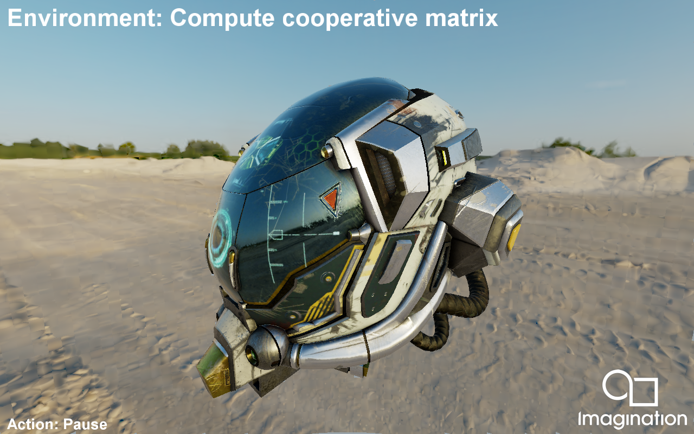

========================
NeuralNetworkEnvironment
========================

This example demonstrates how to use neural networks to encode an environment map, and dynamically show that environment map inferring pixel values instead of using any texture sample or rasterization technique.

API
---
* Vulkan

Description
-----------
This example has two scenes using Metallic-Roughness PBR workflow. It features two scenes, a GLTF model rederered  with  albedo, metallic roughness and emissive map, and a collection of spheres showcasing different metallic and non metallic non-texture values.
The examples uses a Diffuse map pre-computed offline from the environment map, using the lambert diffuse BRDF, and two specular maps (also calculated offline): A Pre-Filtered Environment map for different roughness values, and an Environment BRDF including the rest of the equation.

Controls
--------
- Esc to cloe the application.
- W/A/S/D to rotate around the 3D mesh represented.
- Action1 to pause.

Based on the work by Thies et al [1] and Kuznetsov et al. [2] on neural materials and textures, neural networks are used to add the environment map of a scene. An environment map is divided into tiles of 16x16 pixels. A small neural network (Multi Layer Perceptron) is traioned on each tile to approximate the pixels present in the tile. In this sample, the already trained grid of MLP is loaded and used add the environment information to the scene through compute shader without any rasterization pass.

The steps followed by the algorithm are described below:
1. In a compute pass, a 2D grid of points with a scale of 25% the screen image resolution is considered. The points are distributed uniformly across the screen. For each point, the uv coordinates of the environment texture visible from that point are computed (mimicking a ray casted from that point, following the camera view direction, towards a sphere containing the environment). This allows to know what environment texture tiles are visible from the camera. The bounding boxes of these tiles are back-projected onto screen-space boxes, which are stored in a buffer.
2. A second compute pass process each screen-space box, dividing it into smaller sets of pixel regions which will be later processed.
3. In a final pass, a compute shader is dispatched where each subgroup loads the neural network for the tile it has to process, and takes care of generating all the environment pixels present in that region. A simple 1-byte mask is used in an initial rasterization pass to know wheter a pixel belongs to the environment and has to be generated, or to a scene mesh and should not be processed.

NOTE: This SDK sample has pending several performance and quality optimizations.

References:
[1] Justus Thies, Michael Zollhöfer, and Matthias Nießner. Deferred Neural Rendering: Image Synthesis using Neural Textures. ACM Transactions on Graphics 38 (2019).
[2] Alexandr Kuznetsov, Krishna Mullia, Zexiang Xu, Miloš Hašan, and Ravi Ramamoorthi. NeuMIP: Multi-Resolution Neural Materials. ACM Transactions on Graphics 40 (2021).
